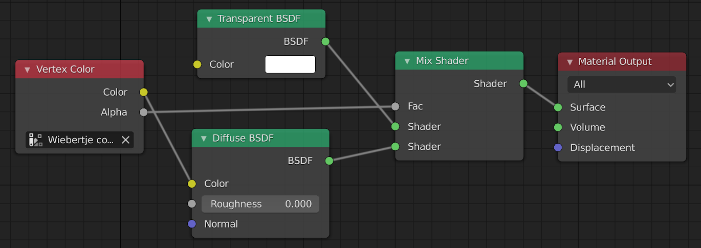

[](https://entangled.github.io/)

# Blender shader DSL
*by Johan Hidding*

This code provides an embedded language within Python to program shaders in Blender. While this goal is very specific, **the technique used is Universal**.

I believe it always a good idea to start a programming story with a morale citing [Structure and Interpretation of Computer Programs](https://web.mit.edu/alexmv/6.037/sicp.pdf). In programming any language there are three important questions:

- What are the **primitives**?
- What are the **means of combination**?
- What are the **means of abstraction**?

In Python all three of these questions have very long answers. The primitives are extensive, thanks to the *batteries included* philosophy. The means of combination are plenty, depending on the chosen abstraction: classes can inherit and be composed, function can be composed. The ultimate abstraction however, is to develop a new language. That sounds like a big deal, and it is. However, it need not be a lot of work if we reuse everything Python already offers. After all, **code is data**.

We develop an **embedded domain specific language** in Python. There are very many potential applications for this technique: it is what underlies [Dask](https://dask.org/)'s delayed functions and [Vaex](https://vaex.io/)'s expressions. In this instance we'll develop a means to script shaders in [Blender](https://www.blender.org/). Blender has an extensive system of shaders and transformers to express material properties of a 3D scene. Shaders are composable in a graphical node editor:



In addition to the node editor, Blender is completely scriptable with Python. The following code creates a material with two nodes and one link.

```python
# create a material
mat = bpy.data.materials.new("my material")
mat.use_nodes = True

# clear default nodes
nodes = mat.node_tree.nodes
nodes.clear()

# add new nodes
shader = nodes.new(type='ShaderNodeBsdfDiffuse')
node_output = nodes.new(type='ShaderNodeOutputMaterial')

# add a link
links = mat.node_tree.links
links.new(shader.outputs[0], node_output.inputs[0])
```

The downside of this API is that it is a bit explicit in the construction of the node graph. Wouldn't it be nice if we could write a shader in a way more suitable to a an actual programming language? In an attempt at wishful programming, we can express the shader shown in the previous image as follows:

```python
from shader_dsl import (make_material, VertexColor, BsdfTransparent,
                        BsdfDiffuse, MixShader, OutputMaterial)

color_input = VertexColor(layer_name="color layer")
transparent = BsdfTransparent(color=Value((1,1,1,1)))
diffuse = BsdfDiffuse(color=color_input.color)
mix = MixShader(color_input.alpha, transparent.BSDF, diffuse.BSDF)
output_material = OutputMaterial(surface=mix.shader)

mat = make_material("my material", output_material)
```

Each node in the graph is a function call, each link is an argument. This code completely captures the semantics of the graph shown above. I don't know if I'm crazy, but I get very happy if code can be expressed more effectively like this. The question is: how can we make this work?

The [source code of this module](python_dsl) is completely literate, meaning that the entire code is contained in this documentation. Code blocks that are part of the source code are named with "«graph»" identifiers. These names may appear in other code blocks in the form of `<<graph>>` references. The resulting code is a single file Python module.

## Installing
Blender add-ons are not installed like normal Python scripts. To copy `shader_dsl.py` to the `${HOME}/.config/blender/${BLENDER_VERSION}/scripts/addons` location (at least on my Linux system)

```
make install
```

## Development
This is literate program. If you'd like to contribute, you'll need to install [Entangled](https://entangled.github.io). Be sure to have the Entangled daemon running while editing `docs/python_dsl.md` or `shader_dsl.py`. From the project root, run:

```bash
entangled daemon
```

The website is generated with [MkDocs](https://www.mkdocs.org/), and needs some plugins installed:

```bash
pip install mkdocs entangled-filters pymdown-extensions
```

To get a live preview of the rendered output, run:

```bash
mkdocs serve
```

### Linters
This code is checked with `flake8` and `mypy`.

